# **🧩 AgentForge Voice Pipeline — Debugging Flowchart**

```mermaid
flowchart TD
    START([Pipeline Failure Detected]) --> Q1{Where did the failure occur?}

    %% --------------------------------------
    %% ASR FAILURE PATH
    %% --------------------------------------
    Q1 -->|ASR step| ASRCHK[Check ASR logs<br/><code>docker-compose logs -f asr-service</code>]
    ASRCHK --> ASRCAUSE{Common Causes}
    ASRCAUSE -->|Bad Audio Format| ASR1[Re-encode audio to 16kHz mono WAV<br/><code>ffmpeg -ar 16000 -ac 1</code>]
    ASRCAUSE -->|Model Not Loaded| ASR2[Verify WhisperX model path<br/>Rebuild container]
    ASRCAUSE -->|GPU Unavailable| ASR3[Run <code>nvidia-smi</code> inside container<br/>Fix GPU runtime]
    ASRCAUSE -->|Transcript gibberish| ASR4[Try larger Whisper model<br/>Use cleaner audio]
    ASR1 --> RETEST1[[Re-run pipeline]]
    ASR2 --> RETEST1
    ASR3 --> RETEST1
    ASR4 --> RETEST1

    %% --------------------------------------
    %% ALIGNMENT FAILURE PATH
    %% --------------------------------------
    Q1 -->|Alignment step| ALCHK[Check Alignment logs<br/><code>docker-compose logs -f alignment-service</code>]
    ALCHK --> ALCAUSE{Common Causes}
    ALCAUSE -->|Transcript mismatch| AL1[Use ASR transcript<br/>Fix text before alignment]
    ALCAUSE -->|MFA dict missing| AL2[Check CMU dict availability]
    ALCAUSE -->|Empty alignment| AL3[Audio speech too short<br/>ASR output incorrect]
    AL1 --> RETEST1
    AL2 --> RETEST1
    AL3 --> RETEST1

    %% --------------------------------------
    %% PHONEME MAP FAILURE PATH
    %% --------------------------------------
    Q1 -->|Phoneme Map step| PMCHK[Check Phoneme Map logs]
    PMCHK --> PMCAUSE{Common Causes}
    PMCAUSE -->|Word OOV| PM1[Enable grapheme-to-phoneme fallback]
    PMCAUSE -->|Case mismatch| PM2[Lowercase words before lookup]
    PMCAUSE -->|Dict load error| PM3[Verify CMUdict installed]
    PM1 --> RETEST1
    PM2 --> RETEST1
    PM3 --> RETEST1

    %% --------------------------------------
    %% DIFF FAILURE PATH
    %% --------------------------------------
    Q1 -->|Phoneme Diff step| DIFFCHK[Check Diff Service logs]
    DIFFCHK --> DIFFCAUSE{Common Causes}
    DIFFCAUSE -->|Phoneme mismatch not detected| DF1[Normalize phonemes<br/>Remove stress numbers]
    DIFFCAUSE -->|Wrong JSON format| DF2[Fix input schema]
    DF1 --> RETEST1
    DF2 --> RETEST1

    %% --------------------------------------
    %% TTS FAILURE PATH
    %% --------------------------------------
    Q1 -->|TTS step| TTSCHK[Check TTS logs]
    TTSCHK --> TTSCAUSE{Common Causes}
    TTSCAUSE -->|CUDA OOM| T1[Switch to FP16<br/>Use smaller model]
    TTSCAUSE -->|Model missing| T2[Re-download XTTS model]
    TTSCAUSE -->|Distorted audio| T3[Check sample rate match]
    T1 --> RETEST1
    T2 --> RETEST1
    T3 --> RETEST1

    %% --------------------------------------
    %% VOICE CONVERSION FAILURE PATH
    %% --------------------------------------
    Q1 -->|VC step| VCCHK[Check VC logs]
    VCCHK --> VCCAUSE{Common Causes}
    VCCAUSE -->|Missing user samples| VC1[Upload user samples to MinIO]
    VCCAUSE -->|Noise / unclear output| VC2[Increase RVC training steps]
    VCCAUSE -->|GPU unavailable| VC3[Verify GPU runtime]
    VC1 --> RETEST1
    VC2 --> RETEST1
    VC3 --> RETEST1

    %% --------------------------------------
    %% LLM FEEDBACK FAILURE PATH
    %% --------------------------------------
    Q1 -->|LLM feedback step| LLMCHK[Check LLM logs]
    LLMCHK --> LLMCAUSE{Common Causes}
    LLMCAUSE -->|Invalid JSON output| LLM1[Use strict response_format<br/>temperature=0]
    LLMCAUSE -->|Hallucinated phonemes| LLM2[Improve guardrails<br/>Fix prompt template]
    LLMCAUSE -->|API key error| LLM3[Fix OPENAI_API_KEY/GEMINI_API_KEY in .env]
    LLM1 --> RETEST1
    LLM2 --> RETEST1
    LLM3 --> RETEST1

    %% --------------------------------------
    %% ORCHESTRATOR FAILURE PATH
    %% --------------------------------------
    Q1 -->|Pipeline stops unexpectedly| ORCHCHK[Check Orchestrator logs]
    ORCHCHK --> ORCHCAUSE{Common Causes}
    ORCHCAUSE -->|Service URL wrong| O1[Fix docker-compose hostnames]
    ORCHCAUSE -->|Timeout| O2[Increase timeout + retries]
    ORCHCAUSE -->|Bad merge of outputs| O3[Fix results_builder schema]
    O1 --> RETEST1
    O2 --> RETEST1
    O3 --> RETEST1

    %% --------------------------------------
    %% MINIO / STORAGE FAILURE PATH
    %% --------------------------------------
    Q1 -->|File not found / S3 error| S3CHK[Check MinIO Logs + Console]
    S3CHK --> S3CAUSE{Common Causes}
    S3CAUSE -->|Wrong bucket| S3_1[Ensure bucket=audio]
    S3CAUSE -->|Wrong prefix| S3_2[Check taskId folder structure]
    S3CAUSE -->|Credentials wrong| S3_3[Fix MINIO env vars]
    S3_1 --> RETEST1
    S3_2 --> RETEST1
    S3_3 --> RETEST1

    %% --------------------------------------
    %% POSTGRES FAILURE PATH
    %% --------------------------------------
    Q1 -->|Task not updated| PGCHK[Check Postgres Logs]
    PGCHK --> PGCAUSE{Common Causes}
    PGCAUSE -->|DB not reachable| PG1[Fix DATABASE_URL]
    PGCAUSE -->|Row conflicts| PG2[Rerun migrations]
    PGCAUSE -->|Wrong schema| PG3[Validate task table structure]
    PG1 --> RETEST1
    PG2 --> RETEST1
    PG3 --> RETEST1

    %% --------------------------------------
    %% RETEST
    RETEST1 --> END([Pipeline Should Now Complete Successfully])
```

---

# ✔ What This Flowchart Gives You

### ✓ A **single visual path** to debug any failure

### ✓ Covers **every microservice** + S3 + DB + Orchestrator

### ✓ Shows **root causes + exact fixes**

### ✓ Helps interns quickly diagnose failures

### ✓ Ideal for Slack/Notion/GitHub documentation
