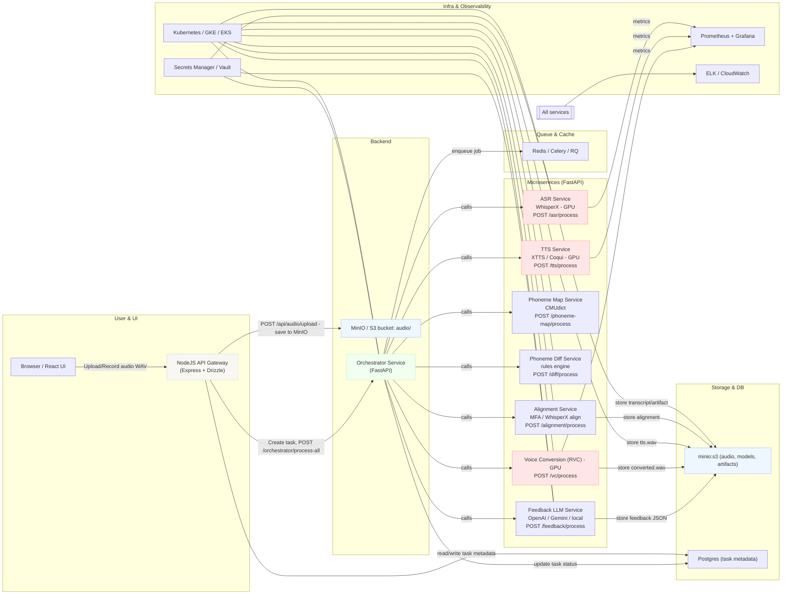
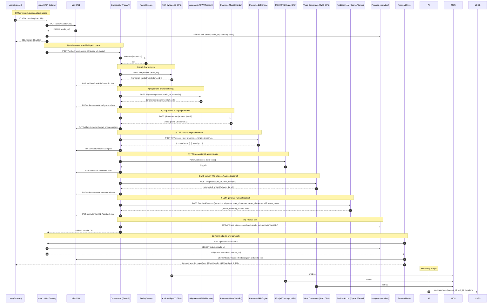
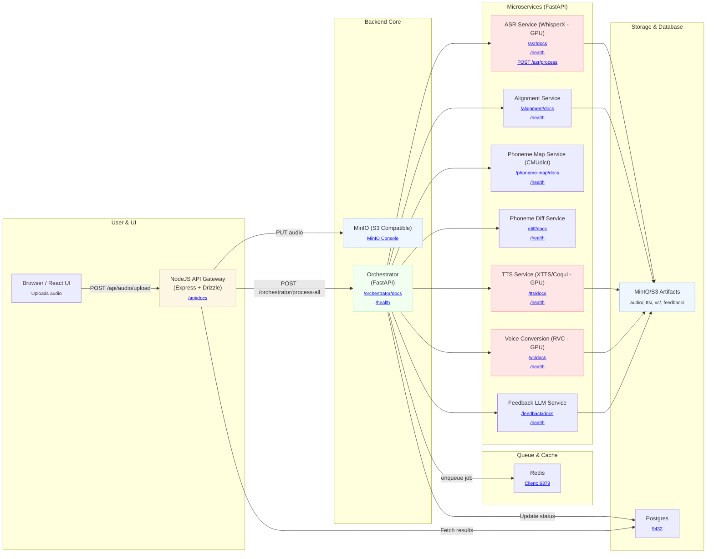
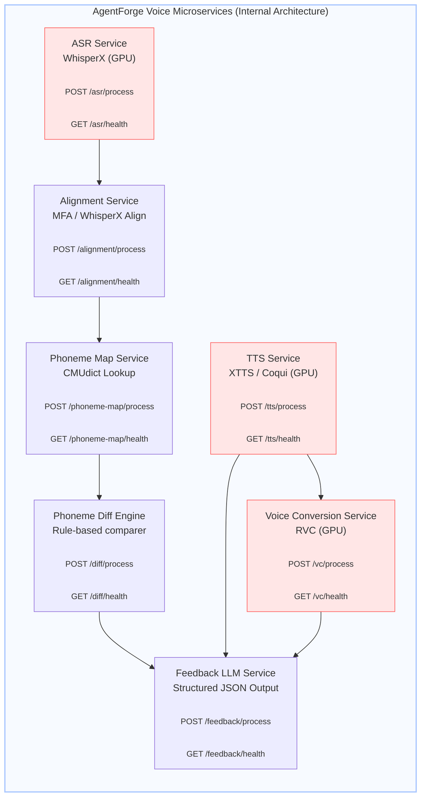
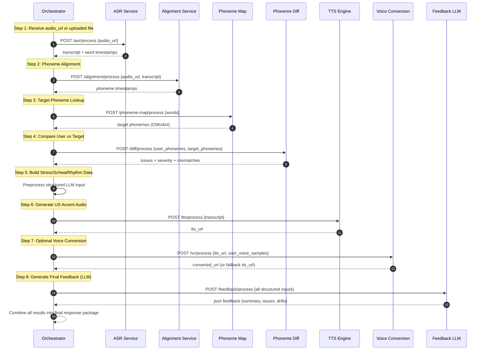

### 1) Architecture Flowchart (Mermaid)

---

### 2) End-to-End Sequence Diagram (Mermaid)

---

Below is an **enhanced Mermaid diagram** with **clickable nodes** that link to example endpoints (health checks, process endpoints, API docs).
This is the **developer-friendly version** you can paste directly into GitHub or documentation.

Mermaid supports clickable nodes, and here I’ve embedded example localhost URLs (you can replace ports as per your docker-compose).

---

# ✅ **Enhanced Developer Architecture Diagram with Clickable Nodes**

---

# 🚀 What This Version Gives Developers

### ✔ Clickable links to:

* `/docs` for every microservice
* `/health` for quick testing
* MinIO console
* NodeJS docs
* Database/Redis ports

### ✔ Shows exact endpoints:

* `/asr/process`
* `/alignment/process`
* `/phoneme-map/process`
* `/diff/process`
* `/tts/process`
* `/vc/process`
* `/feedback/process`
* `/orchestrator/process-all`

### ✔ Highlights GPU services visually

### ✔ Maps artifact flow to MinIO

### ✔ Maps metadata flow to Postgres

### ✔ Useful for README, Wiki, Developer Onboarding

---

Below are **two clean developer-focused Mermaid diagrams**:

---

# **📘 Diagram 2 — Internal Microservices Architecture (Developer-Focused Only)**

*(Shows ONLY FastAPI microservices, their responsibilities, key endpoints, and interactions)*

### ✔ This diagram is perfect for developers because:

* It isolates **only the ML microservices**
* Shows **what each microservice does**
* Shows **key endpoints**
* Highlights **GPU-dependent services**
* Shows **internal data dependencies**

---

# **📘 Diagram 3 — Orchestrator Internal Flow (Step 1 → 8)**

*(This shows EXACTLY how the pipeline works inside the Orchestrator)*

### ✔ This diagram is perfect because:

* It **teaches developers the entire pipeline flow**
* Shows EXACT sequence of microservice calls
* Annotates each step with purpose
* Shows what input/output each service consumes/produces
* Helps backend devs debug the pipeline stage-by-stage
* Ideal for onboarding + documentation
