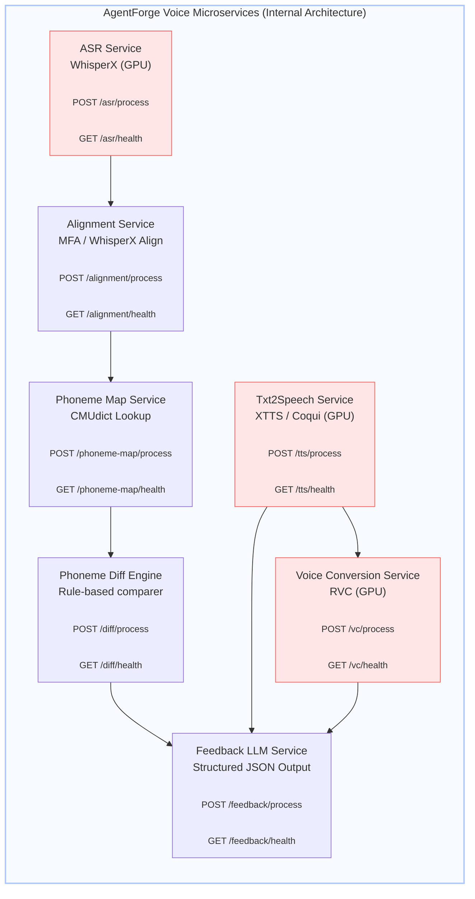
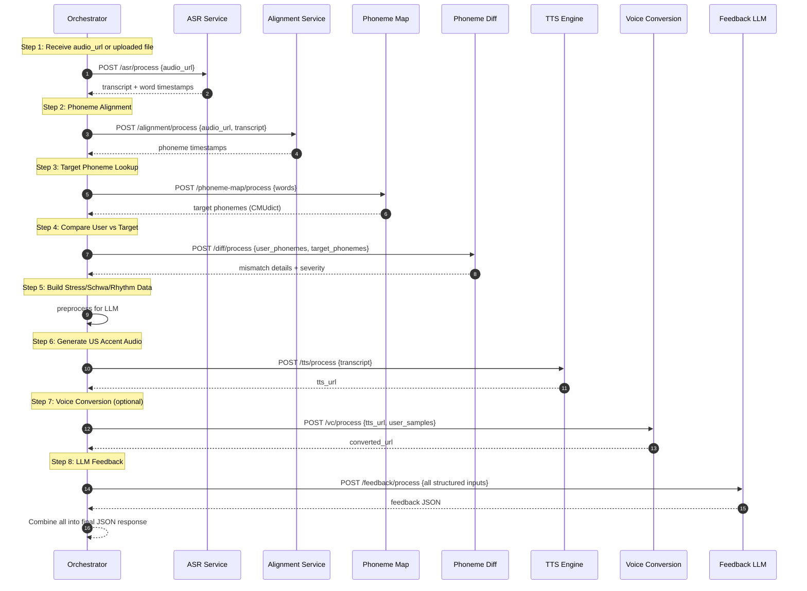

# **TECHNICAL SPECIFICATION DOCUMENT — AgentForge Voice Processing System (MVP)**

### *Version 1.0 — For Backend Developers & Interns*

---

## **1. Overview**

The AgentForge Voice Processing System is a distributed collection of FastAPI microservices that work together to analyze user speech, detect pronunciation deviations, and generate US-accent training feedback.

The system performs:

* Automatic Speech Recognition (ASR)
* Phoneme alignment
* Phoneme extraction
* Target phoneme mapping (CMUdict)
* Phoneme mismatch detection
* Speech synthesis (TTS)
* Voice conversion (VC)
* LLM-based structured feedback

All components are orchestrated by a central **Orchestrator Service**.

---

# **2. High-Level Architecture**

The voice pipeline consists of:

* **NodeJS API Gateway** (handles audio upload & task creation)
* **Orchestrator** (pipeline manager)
* **7 FastAPI microservices**
* **MinIO/S3** (artifact storage)
* **Redis** (queue)
* **Postgres** (metadata, task tracking)

---

# **3. Internal Microservices Architecture (Developer View)**

### 📘 *Diagram: Microservices Only*



---

# **4. Orchestrator Internal Flow (Step-by-Step)**

### 📘 *Diagram: Orchestrator Sequence (Developer-Focused)*



---

# **5. Microservice Responsibilities (Detailed)**

### **ASR Service**

* Uses WhisperX (GPU)
* Outputs transcript + word-level timestamps
* Input: audio_url or file upload

### **Alignment Service**

* Produces phoneme timestamps
* Uses MFA or WhisperX alignment backend
* Requires transcript + audio

### **Phoneme Map Service**

* Maps target English phonemes via CMUdict
* Required for pronunciation comparison

### **Phoneme Diff Service**

* Compares user phonemes vs CMUdict target phonemes
* Detects vowel shifts, consonant errors, missing schwa
* Outputs severity-scored issues

### **TTS Service**

* Produces US-accent standard audio (WAV format, 24kHz)
* Uses Gemini TTS API (`gemini-2.5-flash-preview-tts`)
* Uploads generated audio to S3/MinIO

**Available Voices (30 options):**
| Voice | Voice | Voice | Voice | Voice |
|-------|-------|-------|-------|-------|
| Aoede | Charon | Fenrir | **Kore** (default) | Puck |
| Zephyr | Orus | Leda | Helios | Nova |
| Altair | Lyra | Orion | Vega | Clio |
| Dorus | Echo | Fable | Cove | Sky |
| Sage | Ember | Vale | Reef | Aria |
| Ivy | Stone | Quill | Drift | Briar |

**Supported Languages (24):** en-US, en-IN, de-DE, es-US, fr-FR, hi-IN, id-ID, it-IT, ja-JP, ko-KR, pt-BR, ru-RU, nl-NL, pl-PL, th-TH, tr-TR, vi-VN, ro-RO, uk-UA, bn-BD, mr-IN, ta-IN, te-IN, ar-EG

### **Voice Conversion Service**

* Converts TTS output into user's own voice style
* RVC-based (GPU)

### **LLM Feedback Service**

* Uses Gemini API (`gemini-2.0-flash` by default)
* Applies structured prompts
* Generates:

  * Summary
  * Pronunciation corrections
  * Minimal pair drills
  * Stress/schwa guidance
* Configurable via `GEMINI_API_KEY` and `GEMINI_MODEL` environment variables

---

# **6. Orchestrator Responsibilities**

The orchestrator is the “brain” that:

### ✔ Receives task

### ✔ Calls microservices sequentially

### ✔ Stores artifacts in MinIO

### ✔ Updates Postgres metadata

### ✔ Combines results into final JSON

### ✔ Returns structured output to Node backend

Orchestrator must handle:

* Retry logic
* Timeout handling
* File management
* Mock mode (`MOCK_MODE=true`)

---

# **7. Data Schemas**

### **ASR Output**

```json
{
  "transcript": "hello world",
  "words":[{"word":"hello","start":0.12,"end":0.45}]
}
```

### **Alignment Output**

```json
{"phonemes":[{"phoneme":"HH","start":0.12,"end":0.18}]}
```

### **Phoneme Map Output**

```json
{"map":{"hello":["HH","AH","L","OW"]}}
```

### **Diff Output**

```json
{
  "comparisons":[
    {
      "word":"hello",
      "issue":"vowel_shift",
      "severity":"medium"
    }
  ]
}
```

### **LLM Feedback Output**

```json
{
  "summary":"Your vowel in 'hello' is slightly off.",
  "issues":[...],
  "drills":[...]
}
```

---

# **8. Developer Setup**

### Local Setup

```bash
docker-compose up --build -d
```

### Test ASR

```bash
curl -F "file=@tests/audio/test.wav" http://localhost:8001/asr/process
```

### Run orchestrator end-to-end

```bash
curl -F "file=@tests/audio/test.wav" http://localhost:8010/orchestrator/process-all
```

---

# **9. Acceptance Checklist**

* [ ] All microservices respond to `/health`
* [ ] End-to-end pipeline runs with real audio
* [ ] TTS + voice conversion generated correctly
* [ ] LLM returns structured JSON feedback
* [ ] All artifacts stored in MinIO
* [ ] Task status updated in Postgres
* [ ] All docker services stable under load
* [ ] Mock mode tested for frontend development

---

# **10. Appendix**

### Related Docs (in repo):

* `FOLDER_STRUCTURE.md`
* `DOCKER_COMPOSE_SETUP.md`
* `PROMPT_TEMPLATES.md`
* `OPENAPI_SPECS/`
* `TEST_CASES/`

---
