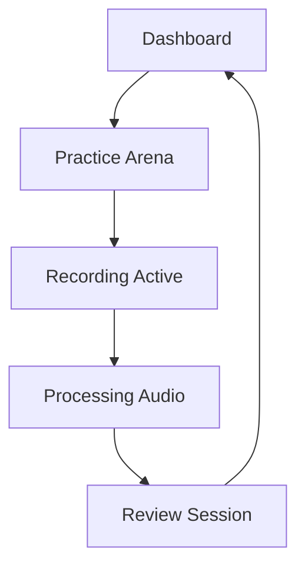

## 1. Product Overview
AgentForge Voice Coach UI is a premium voice analysis AI agent interface designed to help users improve their English pronunciation through real-time feedback and AI-powered voice comparison. The product creates an immersive "Flow State" experience with smooth animations and professional audio visualization.

Target users are English language learners who want to improve their pronunciation through AI-powered feedback and comparison with native speakers. The product helps users identify pronunciation errors, practice with AI-generated voice clones, and receive detailed phonetic analysis.

## 2. Core Features

### 2.1 User Roles
| Role | Registration Method | Core Permissions |
|------|---------------------|------------------|
| Free User | Email registration | Basic recording and analysis (limited sessions) |
| Premium User | Subscription upgrade | Unlimited sessions, advanced analytics, progress tracking |

### 2.2 Feature Module
The voice coach application consists of the following main pages:
1. **Dashboard**: User overview, practice history, progress tracking
2. **Practice Arena**: Main recording interface with real-time waveform visualization
3. **Review Session**: Detailed analysis view with text diff, audio comparison, and phonetic breakdown

### 2.3 Page Details
| Page Name | Module Name | Feature description |
|-----------|-------------|---------------------|
| Dashboard | Progress Overview | Display practice statistics, recent sessions, and improvement trends |
| Dashboard | Quick Start | Button to start new practice session with script selection |
| Practice Arena | Script Display | Show practice text with phonetic transcription |
| Practice Arena | Recording Interface | Start/stop recording with live waveform visualization |
| Practice Arena | Audio Visualizer | Real-time waveform display using wavesurfer.js |
| Review Session | Text Diff Engine | Color-coded word analysis (green=correct, red=error) |
| Review Session | Audio Comparison | Three-tab player for user/native/AI voice comparison |
| Review Session | Phonetic Analysis | Click words to view detailed phoneme breakdown and IPA charts |
| Review Session | Score Display | Animated score ring showing overall pronunciation accuracy |
| Review Session | AI Feedback | LLM-generated coaching tips and improvement suggestions |

## 3. Core Process
**User Practice Flow:**
1. User navigates to Practice Arena from Dashboard
2. User sees practice script and clicks record button
3. System captures audio with live waveform visualization
4. User stops recording and system processes audio
5. System displays detailed analysis with text diff and scores
6. User can replay different voice versions and explore phonetic errors
7. User returns to Dashboard to track progress

## 4. User Interface Design

### 4.1 Design Style
- **Primary Colors**: Dark slate backgrounds (bg-slate-950/900) with violet-500 accents for AI actions
- **Semantic Colors**: green-400 (correct), yellow-400 (warning), red-400 (errors)
- **Typography**: Inter font family with JetBrains Mono for phonetic text
- **Glassmorphism**: bg-slate-900/60 backdrop-blur-xl border border-white/10 for premium feel
- **Animations**: Smooth Framer Motion transitions for layout shifts and component interactions

### 4.2 Page Design Overview
| Page Name | Module Name | UI Elements |
|-----------|-------------|-------------|
| Dashboard | Progress Cards | Glassmorphic cards with subtle borders, Inter font, violet accent buttons |
| Practice Arena | Script Display | Large, readable text (24px+) with phonetic transcription below in JetBrains Mono |
| Practice Arena | Recording Button | Pulsing violet button with smooth scale animations on hover/click |
| Review Session | Text Diff | Color-coded spans with wavy underline for errors, clickable for phonetic details |
| Review Session | Audio Player | Sleek waveform display with three-tab interface for voice comparison |

### 4.3 Responsiveness
Desktop-first design approach with mobile adaptation. Touch interactions optimized for tablet use during practice sessions.