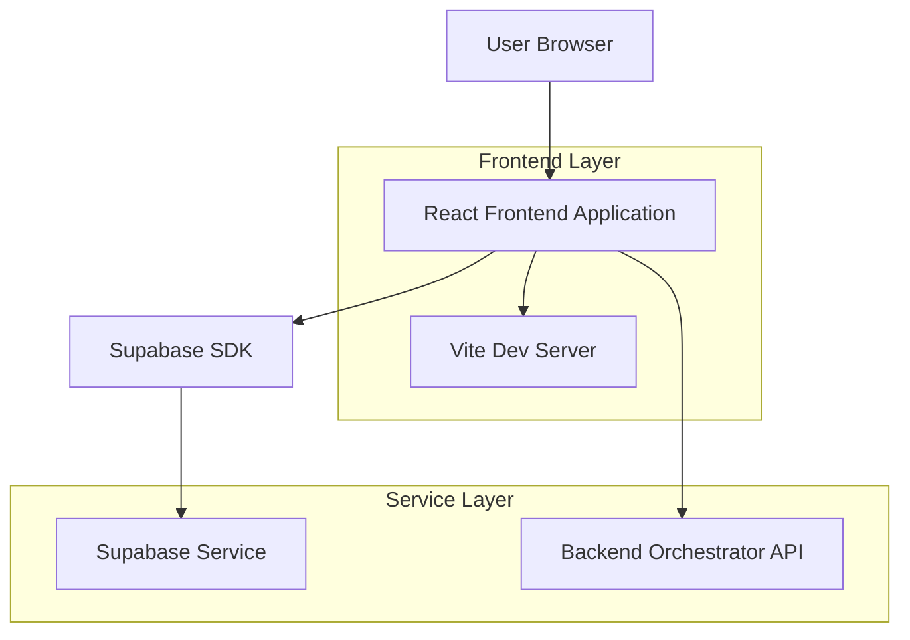
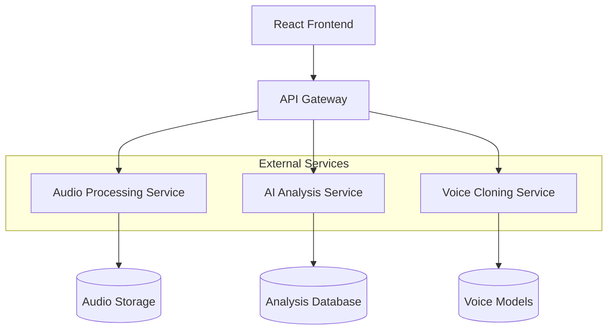
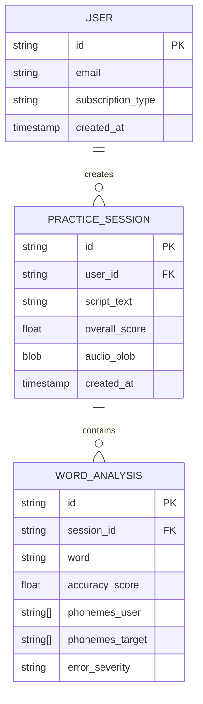

## 1. Architecture Design



## 2. Technology Description

* **Frontend**: React\@18 + TypeScript + Tailwind CSS\@3 + Vite

* **Initialization Tool**: vite-init

* **State Management**: Zustand

* **Audio Processing**: wavesurfer.js + react-media-recorder

* **Animations**: Framer Motion

* **Icons**: Lucide React

* **Backend**: External Orchestrator API (microservices)

* **Authentication**: Supabase Auth

## 3. Route Definitions

| Route              | Purpose                                                |
| ------------------ | ------------------------------------------------------ |
| /                  | Dashboard page with user overview and practice history |
| /practice          | Main practice arena for recording and analysis         |
| /review/:sessionId | Detailed review of completed practice session          |
| /login             | User authentication page                               |
| /profile           | User settings and subscription management              |

## 4. API Definitions

### 4.1 Core API Endpoints

**Audio Analysis Request**

```
POST /api/analyze-audio
```

Request:

| Param Name   | Param Type | isRequired | Description            |
| ------------ | ---------- | ---------- | ---------------------- |
| audio\_blob  | Blob       | true       | Recorded audio file    |
| script\_text | string     | true       | Original practice text |
| user\_id     | string     | true       | User identifier        |

Response:

| Param Name     | Param Type      | Description                     |
| -------------- | --------------- | ------------------------------- |
| analysis\_id   | string          | Unique session identifier       |
| overall\_score | number          | Pronunciation accuracy (0-100)  |
| words          | WordAnalysis\[] | Detailed word-level analysis    |
| audio\_urls    | object          | URLs for comparison audio files |
| feedback       | object          | LLM-generated coaching feedback |

### 4.2 TypeScript Interfaces

```typescript
// types/api-response.d.ts

export interface AudioTimestamps {
  start: number;
  end: number;
}

export interface WordAnalysis {
  word: string;
  timestamps: AudioTimestamps;
  accuracy_score: number;
  phonemes_user: string[];
  phonemes_target: string[];
  is_stress_error: boolean;
  error_severity: 'low' | 'medium' | 'high' | 'none';
}

export interface AnalysisResponse {
  transcript: string;
  overall_score: number;
  words: WordAnalysis[];
  
  audio_urls: {
    original: string;
    tts_us_standard: string;
    tts_user_clone: string;
  };

  feedback: {
    summary: string;
    rhythm_comment: string;
    improvements: string[];
  };
}
```

## 5. Server Architecture Diagram



## 6. Data Model

### 6.1 Data Model Definition



### 6.2 Data Definition Language

```sql
-- Users table
CREATE TABLE users (
    id UUID PRIMARY KEY DEFAULT gen_random_uuid(),
    email VARCHAR(255) UNIQUE NOT NULL,
    subscription_type VARCHAR(20) DEFAULT 'free' CHECK (subscription_type IN ('free', 'premium')),
    created_at TIMESTAMP WITH TIME ZONE DEFAULT NOW()
);

-- Practice sessions table
CREATE TABLE practice_sessions (
    id UUID PRIMARY KEY DEFAULT gen_random_uuid(),
    user_id UUID REFERENCES users(id),
    script_text TEXT NOT NULL,
    overall_score FLOAT,
    audio_url TEXT,
    created_at TIMESTAMP WITH TIME ZONE DEFAULT NOW()
);

-- Word analysis table
CREATE TABLE word_analysis (
    id UUID PRIMARY KEY DEFAULT gen_random_uuid(),
    session_id UUID REFERENCES practice_sessions(id),
    word VARCHAR(100) NOT NULL,
    accuracy_score FLOAT,
    phonemes_user TEXT[],
    phonemes_target TEXT[],
    is_stress_error BOOLEAN DEFAULT FALSE,
    error_severity VARCHAR(10) CHECK (error_severity IN ('low', 'medium', 'high', 'none'))
);

-- Create indexes
CREATE INDEX idx_practice_sessions_user_id ON practice_sessions(user_id);
CREATE INDEX idx_practice_sessions_created_at ON practice_sessions(created_at DESC);
CREATE INDEX idx_word_analysis_session_id ON word_analysis(session_id);

-- Grant permissions
GRANT SELECT ON users TO anon;
GRANT ALL PRIVILEGES ON users TO authenticated;
GRANT SELECT ON practice_sessions TO anon;
GRANT ALL PRIVILEGES ON practice_sessions TO authenticated;
GRANT SELECT ON word_analysis TO anon;
GRANT ALL PRIVILEGES ON word_analysis TO authenticated;
```

